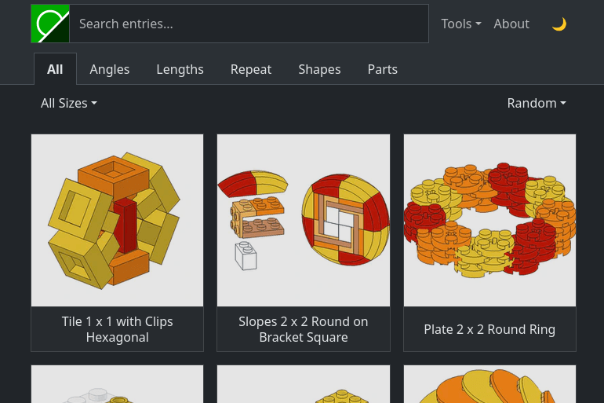

# brick.camp

A visual dictionary of LEGO building techniques — around 230 entries, each
showing a technique with the parts it takes, the space it occupies, and a link to
where it came from.

[](https://new.brick.camp/)

It's a [Hugo](https://gohugo.io/) static site with no backend. The search on the
homepage runs entirely in the browser, against CSV lookup files generated at
build time.

## Running it

Requires **Hugo extended** 0.145 or newer; CI builds with 0.152.2.

```sh
npm install            # PostCSS for the stylesheets, sharp for npm run new
hugo server            # dev server at http://localhost:1313
hugo --gc --minify     # production build into public/
```

Pushing to `main` builds and publishes to GitHub Pages automatically, via
[`.github/workflows/hugo.yaml`](.github/workflows/hugo.yaml).

## Adding content

```sh
npm run new
```

Asks what to add — an entry, a link, a link image or a part — and for the
details, then does it.

**Entries** live at `content/entries/[bucket]/[id]/` — a sequential 4-digit ID,
bucketed by the hundred (`01xx/0142`), so there is never a placement decision;
the next free ID is taken and the folder scaffolded for you. The ID is
shown on the entry page, and `/e/[id]` is a short URL to it. The slug you give
becomes the page url (`/entry/[url-slug]/`) and a first-guess title.
The scaffold comes from [`archetypes/entries.md`](archetypes/entries.md), 
which lists every tag the site understands along with its allowed range.

**Links** append a `linkbox` shortcode to the entry's `index.md` and save the
150×150 preview image next to it as `link_[xx].jpg`. Metadata comes from
[Peekalink](https://www.peekalink.io/) (`PEEKALINK_API_KEY` in `.env`), 
falling back to [Microlink](https://microlink.io/) and the then the page's
own tags; Flickr metadata is read from the page itself, which knows best. 
Review the result — anything the sources didn't know is left as an
empty attribute. A **link image** is the preview-image treatment on its own, 
in case the right image can't be determined automatically. It fetches the given 
image URL and saves it as the entry's next free `link_[xx].jpg`.

Fix up the title, fill in the `size`, the `parts` it uses and whichever tags apply, 
put an 800×800 rendered `image.png` next to `index.md`, then drop `draft = true` 
when it's ready. Tags are written `base-type-value` (`angle-studturn-28`, `shape-polygon-6`); 
malformed ones fail the build and tell you which tag was wrong.

If the entry's image is not yours — a crop from instructions, say — set
`imageCredit` in the front matter to name the rightsholder, and drop an
`ATTRIBUTION.txt` beside the image. `content/entries/font/set-41839/` is an example.

**Parts** get `content/parts/[partnumber]/_index.md` from the Rebrickable API,
with the part image downloaded next to it. 
Adding new parts needs a [Rebrickable API](https://rebrickable.com/api/) key. 
Copy `.env.example` to `.env` and fill it in — it's gitignored, so it won't be committed.

## License

The repository splits three ways:

* **Code** — templates, JavaScript, stylesheets and icons — is [MIT](LICENSE).
* **Content** — entry texts, LDraw models, the renders built from them and the
  entry metadata — is [CC BY 4.0](LICENSE-CONTENT). Credit it as
  `brick.camp — CC BY 4.0 — https://brick.camp/`.
* **Everything else** is third-party material under its own terms: the bundled
  libraries, the Rebrickable part images, the thumbnail beside each source link
  and the LEGO® building-instruction crops in the font entry.
  [THIRD-PARTY.md](THIRD-PARTY.md) lists what and whose — worth a look before
  reusing any image, since some of it sits inside `content/entries/`.

## Notes for AI agents

Architecture notes live in [AGENTS.md](AGENTS.md), which deliberately covers only
what no single file can explain on its own. Everything else is documented in the
partial or module it belongs to.
