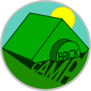
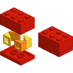
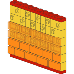

+++
title = 'About brick.camp'
+++

brick.camp aims to be an **easy-to-use, open and secure** online tool to help
LEGO® builders accomplish their goals. Currently, it is still under heavy
development by [Tobias Buckdahn](https://www.brickup.de/).

### Easy-to-use

For beginners and newcomers, some community terms (like
[SNOT, AZMEP, etc.](https://www.brothers-brick.com/lego-glossary/)) might be
confusing. That's why brick.camp structures its entries purely by (unabbreviated)
purpose:

* [Angles](/?base=angle) to change the orientation of a piece.
* [Lengths](/?base=length) to get independent of the stud grid.
* [Repeat](/?base=repeat) to tile a technique across a line, a plane or a volume.
* [Shapes](/?base=shape) to help with some geometries.
* [Parts](/?base=part) to start from an element you already have.

Every category can be narrowed further — by type, by value, by the size of the
result — and anything you type into the search box combines with those filters.
Whatever view you end up with is reflected in the address bar, so it can be
bookmarked or shared as it is.

And there's more on the horizon — stay curious.

### Free and Open

brick.camp is [completely open source](https://github.com/brickcamp/site). This
means, you can study everything:

* The [files for each and every technique](https://github.com/brickcamp/site/tree/main/content/entries)
  published here.
* The [complete history](https://github.com/brickcamp/site/commits/main) of this
  version of the site, and the
  [history of its predecessor](https://github.com/brickcamp/website/commits/main)
  back to its
  [very first step](https://github.com/brickcamp/website/commit/b288341df51d14e9f6ada3dffbbd6108b095d16e)
  in June 2018.
* The [layouts and styles](https://github.com/brickcamp/site/tree/main/layouts)
  this website is built from.
* Really everything — you could even run a local copy: clone the repository and
  run `hugo server`.

Furthermore, images and contents are
[licensed as creative commons](https://creativecommons.org/licenses/by-sa/4.0/)
(CC BY-SA 4.0).

### Secure and Private

This site is non-profit and comes without advertising, tracking and other
burdens of the modern internet. The whole dictionary is delivered as static
files and searched inside your browser, which means we can't see what you 
looked for. The [privacy policy](/privacy/) spells out the remaining details.
