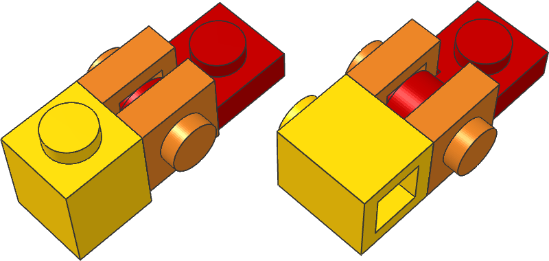

+++
title = 'Plate 1 x 1 with Clip Light'
date  = '2019-04-15'

url     = '/entry/plate-1x1-with-clip-light/'
aliases = ['/tech/plate-1x1-with-clip-light']

parts = ['4081']
size  = ['2s', '1s', '2p']
tags  = [
  'angle-studtilt-90',
  'angle-studtilt-180',
  'partcount-total-1',
]
+++

**Hint:** There are two variants of this part.  
The thin/old one (4081a) has the witdh of a stud minus two plates.  
The thick/new one (4081b) has the width of a plate - or a brick minus two plates.




SNOT used to invert the building direction
